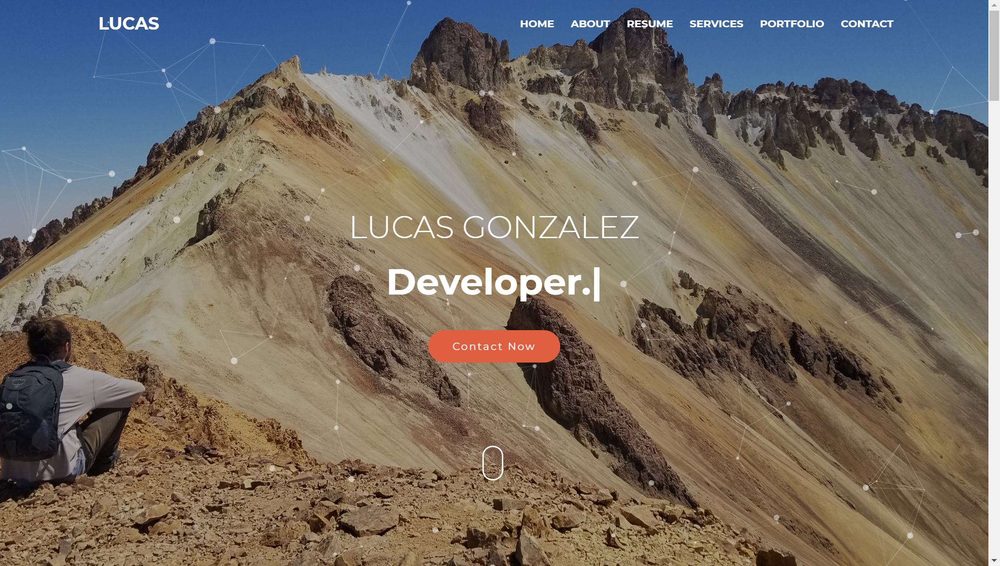
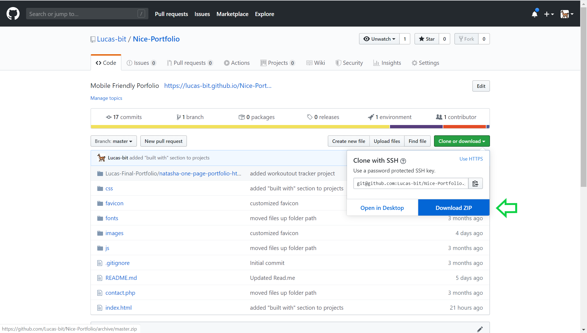
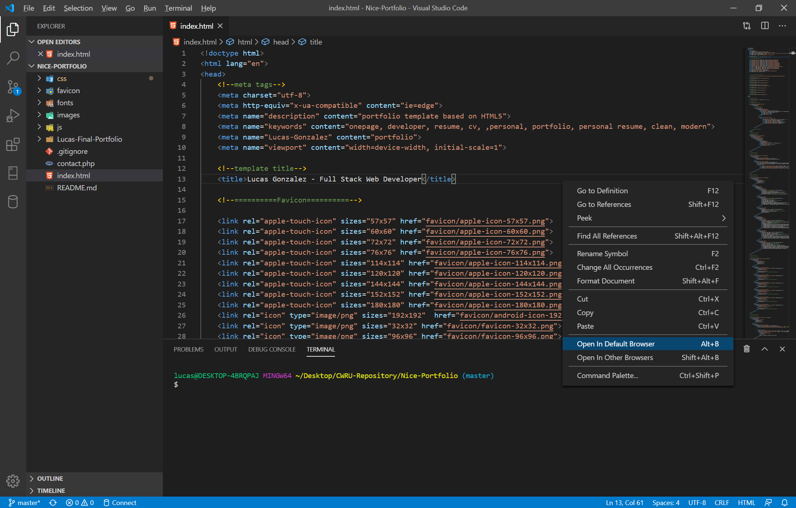

# Nice-Portfolio
Mobile Friendly Porfolio containing resume, projects, skills, and contact information.

 

# Getting Started
These instructions will get you a copy of the project up and running on your local machine for development and testing purposes:

Copy the repository from Github by downloading the zipfile or create a clone, and open in your code editor of choice.

# Deployment

To open locally on your machine open the unzipped folder in the code editor of your choice. Navigate to the index.html file in the root of the folder. Right click on the index.html file and select 'Open in Default Broswer' as pictured below.

# Built With 
VS Code

Javascript, JQuery, Bootstrap, HTML5, CSS3
